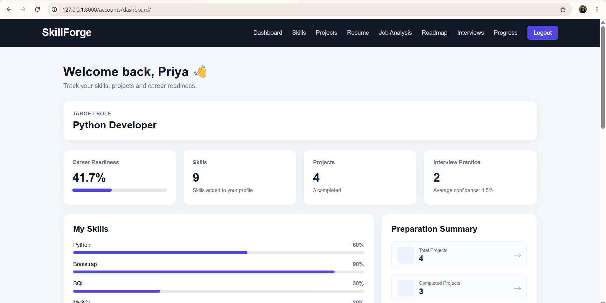
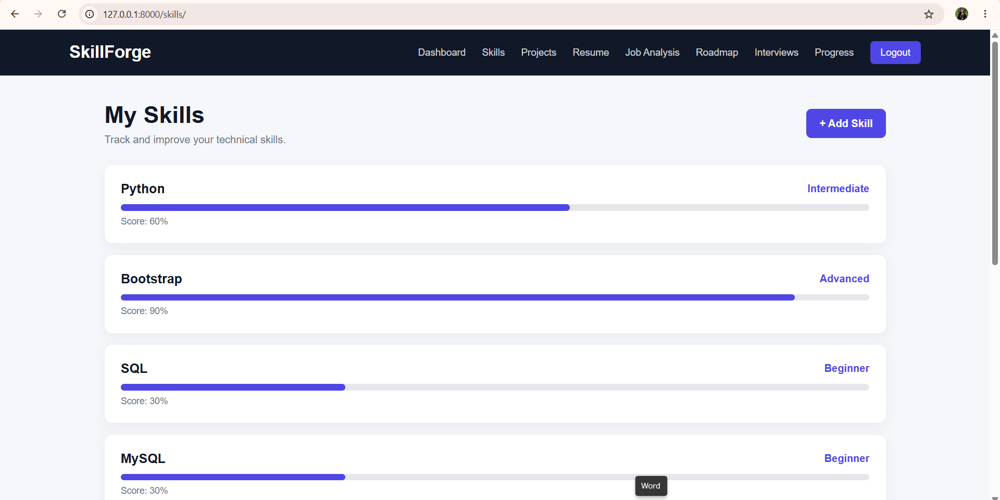
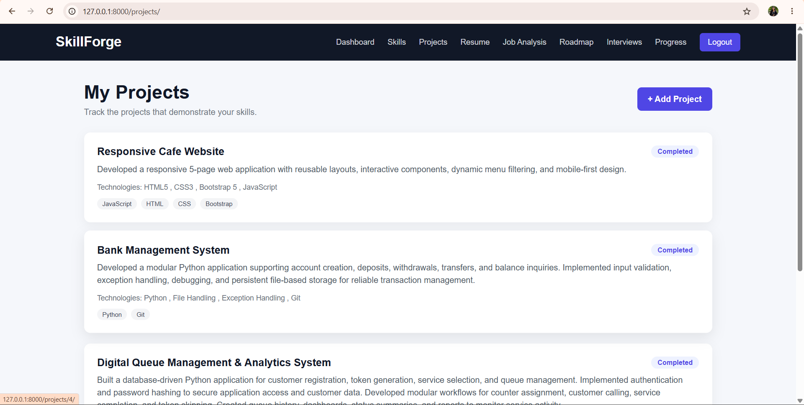
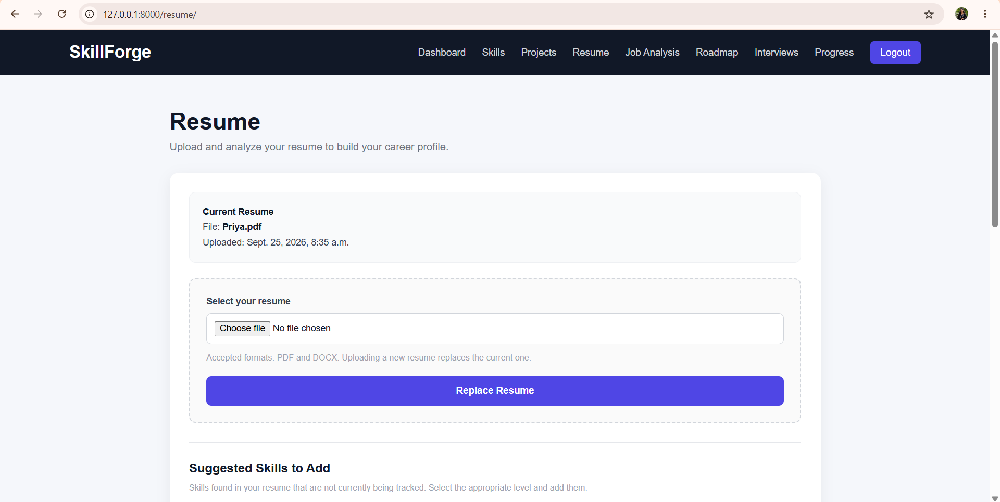
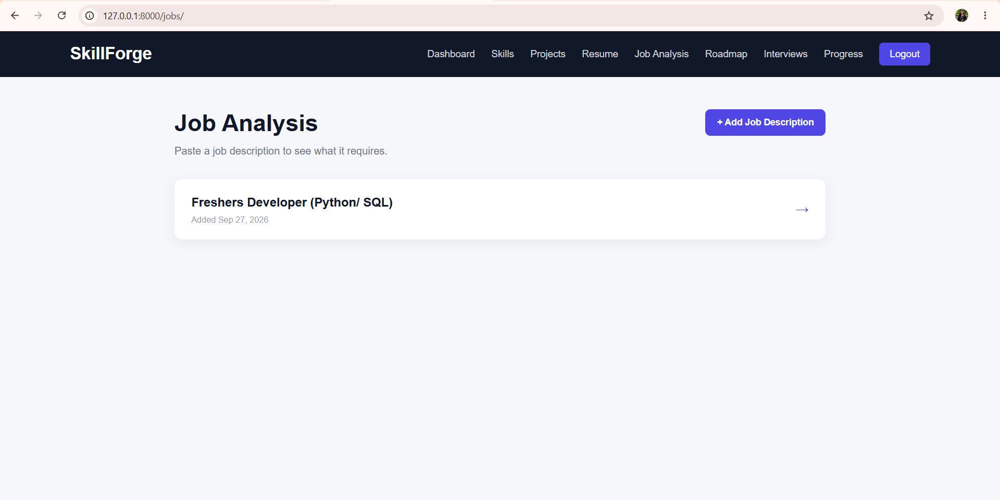
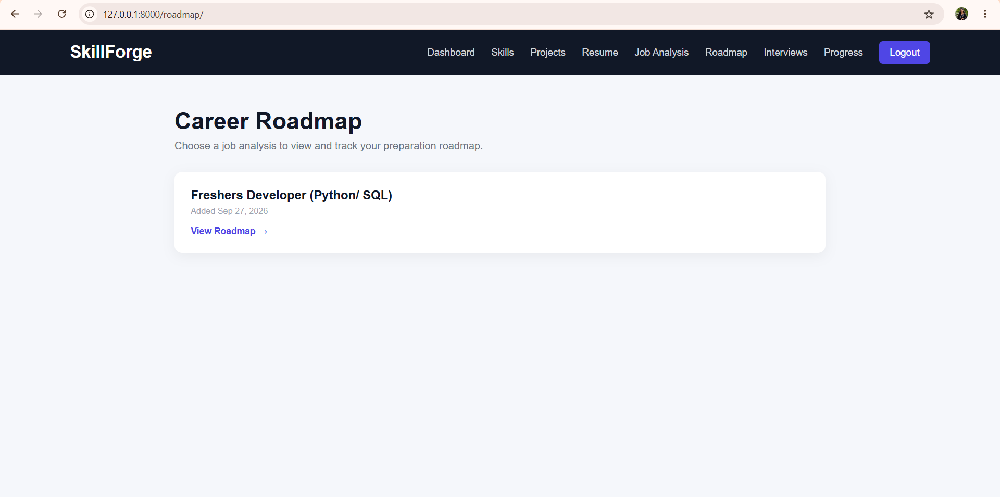
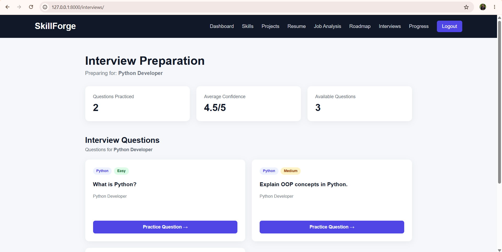
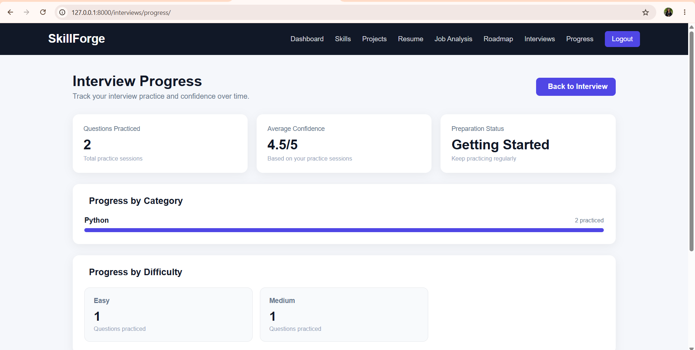

# SkillForge

A Django-based Career Readiness and Job Preparation Platform designed to help users manage their skills, projects, resumes, job requirements, interview preparation, career roadmaps, and overall career readiness in one place.

## 🚀 Features

- User registration and authentication
- User profile and target role management
- Career readiness dashboard
- Skill management and proficiency tracking
- Project management
- Resume upload and management
- Resume skill and project detection
- Job description management
- Job requirement analysis
- Skill and job matching
- Career preparation roadmap
- Role-specific interview preparation
- Skill-based interview questions
- Project-based interview questions
- Interview practice sessions
- Interview confidence tracking
- Interview progress tracking
- Career readiness tracking
- Responsive web interface
- Django ORM and database relationships
- Database migrations
- Git & GitHub version control

## 🛠️ Technologies Used

- Python
- Django
- HTML5
- CSS3
- Bootstrap
- JavaScript
- MySQL / SQLite
- Django ORM
- Git & GitHub

## 📂 Project Structure

```text
SkillForge/
│
├── accounts/
│   ├── migrations/
│   ├── templates/
│   ├── admin.py
│   ├── models.py
│   ├── urls.py
│   └── views.py
│
├── skills/
│   ├── migrations/
│   ├── templates/
│   ├── admin.py
│   ├── models.py
│   ├── urls.py
│   └── views.py
│
├── projects/
│   ├── migrations/
│   ├── templates/
│   ├── admin.py
│   ├── models.py
│   ├── urls.py
│   └── views.py
│
├── resume/
│   ├── migrations/
│   ├── templates/
│   ├── admin.py
│   ├── models.py
│   ├── urls.py
│   └── views.py
│
├── jobs/
│   ├── migrations/
│   ├── templates/
│   ├── admin.py
│   ├── models.py
│   ├── urls.py
│   └── views.py
│
├── roadmap/
│   ├── management/
│   ├── migrations/
│   ├── templates/
│   ├── admin.py
│   ├── models.py
│   ├── urls.py
│   └── views.py
│
├── interviews/
│   ├── migrations/
│   ├── templates/
│   ├── admin.py
│   ├── models.py
│   ├── urls.py
│   └── views.py
│
├── readiness/
│   ├── migrations/
│   ├── templates/
│   ├── admin.py
│   ├── models.py
│   ├── urls.py
│   └── views.py
│
├── api/
│
├── config/
│   ├── settings.py
│   ├── urls.py
│   ├── asgi.py
│   └── wsgi.py
│
├── templates/
│   └── base.html
│
├── manage.py
├── requirements.txt
├── .gitignore
└── README.md
```

## ⚙️ Installation

### 1. Clone the Repository

```bash
git clone https://github.com/Priyu-code14/SkillForge.git
```

### 2. Navigate to the Project Folder

```bash
cd SkillForge
```

### 3. Create a Virtual Environment

```bash
py -m venv venv
```

### 4. Activate the Virtual Environment

For Windows PowerShell:

```bash
venv\Scripts\Activate.ps1
```

### 5. Install Required Packages

```bash
pip install -r requirements.txt
```

### 6. Configure Environment Variables

Create a `.env` file in the project root.

Example:

```env
SECRET_KEY=your-secret-key
DEBUG=True
```

Keep the `.env` file private and do not commit it to GitHub.

### 7. Apply Database Migrations

```bash
py manage.py migrate
```

### 8. Create an Admin Account

```bash
py manage.py createsuperuser
```

### 9. Run the Development Server

```bash
py manage.py runserver
```

Open the application at:

```text
http://127.0.0.1:8000/
```

## 🧪 Project Verification

Run Django's system check:

```bash
py manage.py check
```

Check applied migrations:

```bash
py manage.py showmigrations
```

Check for model changes:

```bash
py manage.py makemigrations --check
```

## 🎯 Project Objective

The objective of SkillForge is to provide a centralized platform for career preparation by helping users evaluate their current skills, manage projects, analyze job requirements, prepare for interviews, build personalized preparation roadmaps, and track overall career readiness.

## 🖥️ Application Screenshots

### Dashboard



### Skills Management



### Project Management



### Resume Management



### Job Analysis



### Career Roadmap



### Interview Preparation



### Interview Progress



## 🔄 How SkillForge Works

1. User creates an account and selects a target role.
2. User adds technical skills and proficiency levels.
3. User adds and manages projects.
4. User uploads a resume.
5. Resume information can be used to identify skills and projects.
6. User adds job descriptions for analysis.
7. Job requirements are compared with the user's existing skills.
8. SkillForge identifies preparation areas.
9. User follows a career preparation roadmap.
10. User practices role-specific, skill-based, and project-based interview questions.
11. Interview confidence and progress are tracked.
12. Career readiness information is displayed through the dashboard.

## 💡 Technical Highlights

This project demonstrates practical experience with:

- Django MVT architecture
- Django ORM
- Model relationships
- CRUD operations
- User authentication
- Django forms and validation
- URL routing
- Template inheritance
- Database migrations
- File upload handling
- Resume data processing
- Job requirement analysis
- Skill matching
- Interview preparation workflows
- Progress tracking
- Responsive web design
- Bootstrap components
- JavaScript interactions
- Git version control
- GitHub repository management

## 📊 Main Modules

### 👤 Accounts

- User registration
- User login and logout
- User profile
- Target role selection
- Career dashboard

### 🧠 Skills

- Add skills
- Track skill proficiency
- View skills
- Connect skills with target roles

### 💻 Projects

- Add projects
- Edit projects
- Delete projects
- View project details
- Track project completion

### 📄 Resume

- Upload resume
- Manage uploaded resume
- Extract resume-related information
- Detect skills and projects from resume content

### 💼 Job Analysis

- Add job descriptions
- Store job requirements
- Analyze required skills
- Compare job requirements with user skills
- Identify preparation requirements

### 🗺️ Roadmap

- Create career preparation goals
- Organize preparation steps
- Track roadmap progress
- Connect preparation with job requirements

### 🎤 Interview Preparation

- Role-specific questions
- Skill-based questions
- Project-based questions
- Interview practice sessions
- Confidence tracking
- Interview progress tracking

### 📈 Career Readiness

- Track preparation progress
- Combine career preparation information
- Display readiness information through the dashboard

## 📱 Responsive Design

SkillForge includes responsive layouts for:

- Desktop
- Laptop
- Tablet
- Mobile devices

The navigation system also includes a mobile menu for smaller screens.

## 🔐 Security

The project includes:

- Django authentication
- CSRF protection
- Environment variable configuration
- Password handling through Django authentication
- `.env` protection through `.gitignore`

## 📚 What I Learned

Through SkillForge, I gained hands-on experience in developing a multi-module Django application and connecting different career preparation workflows into a single platform.

Key learning areas include:

- Building a complete Django project
- Creating modular Django applications
- Designing relational database models
- Implementing CRUD functionality
- Working with Django ORM
- Managing migrations
- Building authentication workflows
- Handling file uploads
- Processing resume information
- Creating job analysis workflows
- Building interview preparation features
- Creating responsive user interfaces
- Using Git and GitHub for version control

## 🔮 Future Enhancements

- Advanced resume parsing
- More detailed job-skill matching
- Personalized learning recommendations
- Interactive career-readiness charts
- Expanded interview question bank
- Advanced roadmap personalization
- REST API expansion
- Automated testing
- Production deployment
- Cloud database integration
- AI-assisted career recommendations

## 📌 Project Status

**Status: Completed Core Development**

Current modules include:

- Authentication
- User Profile
- Career Dashboard
- Skill Management
- Project Management
- Resume Management
- Job Analysis
- Career Roadmap
- Interview Preparation
- Interview Progress
- Career Readiness
- Responsive UI

## 🔗 Repository

**GitHub:**  
https://github.com/Priyu-code14/SkillForge

## 👩‍💻 Author

**Priyadharshini**

Python Full Stack Developer

GitHub:  
https://github.com/Priyu-code14